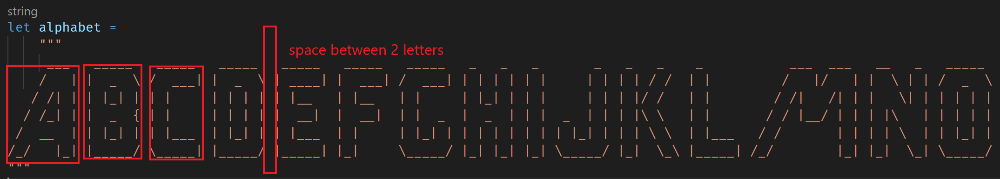

# AsciiArtKataFsharp
Ascii Art kata Fsharp

## Build project

> Run `build.cmd` or `build.sh`

## Run live tests

Windows:
> .\build.cmd Watch

Unix:
> ./build.sh Watch

A file watcher will run test each time you will save your implementation

---

## Alphabet

At first, we have to understand how to analyse the alphabet.

- Split the string in lines
- Identify column's spaces
- Group lines segments by letters
- Build a dictionary of `char * string []` 

## TODO

Each step is descripted in `Generator.fs`

